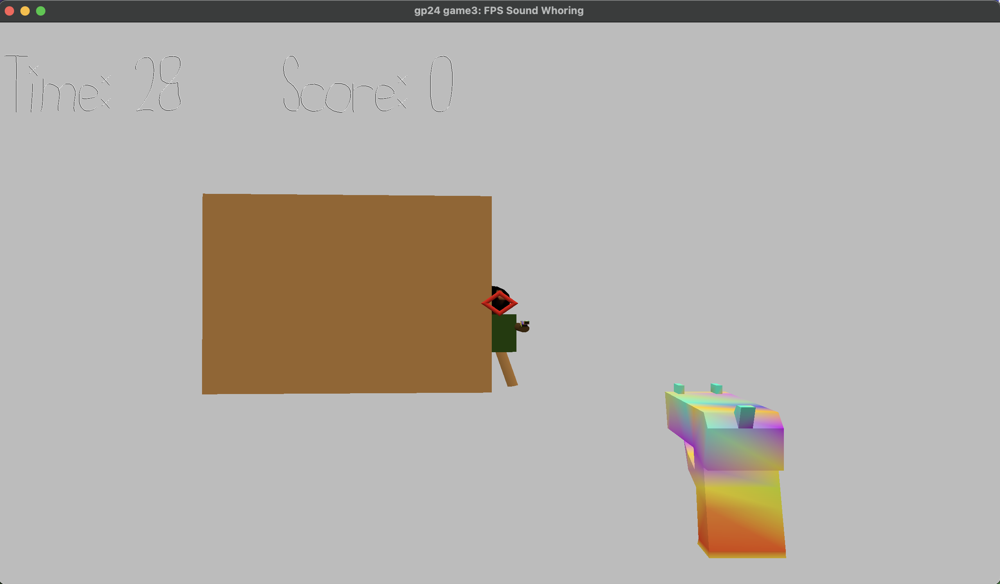

# FPS Sound Whoring

Author: Messi Tu

Design: This game uses audios as cues to make players identify the locations of the enemies. It is commonly referred to "Sound Whoring" in FPS games, which is an essential skill in most competitive FPS games.

Screen Shot:

How To Play: 

Please put on your headphones to play the game. Otherwise the audios do not sound like in a 3D space. Listen to the laser gun audio to locate the enemies. Move the mouse and aim the enemies' heads with the crosshair and left click the mouse to shoot. (The gunshot hit check is very naive so there could be some score bugs during the gameplay.) 

This game was built with [NEST](NEST.md).
